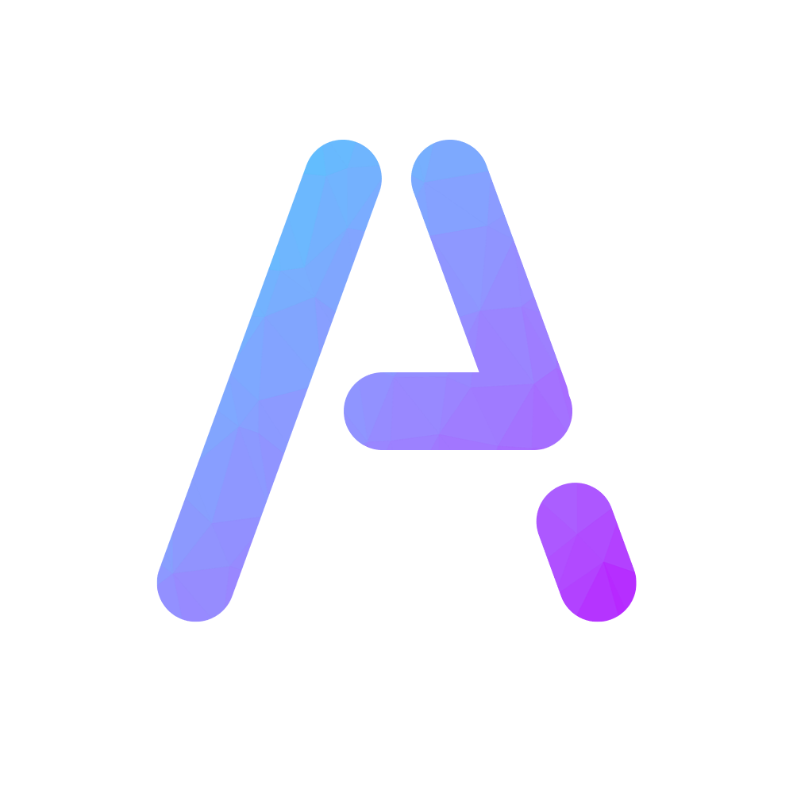

<h3 align="center">
  
   
</h3>

  
  **[소개](#소개) · [Contact Me](#contact-me) · [사용 가능한 기술](#사용-가능한-기술) · [프로젝트 리스트](#프로젝트-리스트) · [수상 기록](#수상-기록)**
  

## 소개
- 경북대학교 컴퓨터학부 재학 (2024~)
- 호산고등학교 제3기 로봇공학반 (2021~2024)
- 교내 소프트웨어 개발팀 [호산고 데브랩(HosanDevLab)](https://github.com/HosanDevLab) 팀장 (2021~2024)
- 디스코드 봇 개발팀 [Infinite Studio](https://inft.kr) 대표 (2018~)

  

## Contact Me
- Email: [**me@arpaap.dev**](mailto:me@arpaap.dev) (개인) **|** [**alpha@knu.ac.kr**](mailto:alpha@knu.ac.kr) (학교)

## 사용 가능한 기술
굵은 글씨는 주로 사용하는 언어, 프레임워크, 라이브러리입니다.

### 프로그래밍 언어
- [**Python**](https://www.python.org)
- **JavaScript & [TypeScript](https://www.typescriptlang.org)**
- C, C++, C#
- [Kotlin](https://kotlinlang.org)
- [Swift](https://www.swift.org/)
- [Rust](https://www.rust-lang.org/)
- [Dart](https://dart.dev)

### 웹 프론트엔드
- [**React**](https://ko.reactjs.org)
- [**Next.js**](https://nextjs.org)
- [Vue.js](https://vuejs.org)

### 웹 백엔드
- [**Next.js**](https://nextjs.org)
- [**Express.js**](https://expressjs.com)
- [**Nest.js**](https://nestjs.com)
- [Django](https://www.djangoproject.com)

### 모바일 애플리케이션
- [**Flutter**](https://flutter.dev)
- [React Native](https://reactnative.dev)

### 데이터베이스
- **[MySQL](https://www.mysql.com) & [MariaDB](https://mariadb.org)**
- [**MongoDB**](https://www.mongodb.com)
- [**Firebase**](https://firebase.google.com)

## 프로젝트 리스트

### Aztra - 웹 대시보드 기반 디스코드 관리봇 (2020.08.31 ~ 진행 중)
- https://aztra.xyz
- ~~**웹 대시보드 사이트(Next.js)**: [`InfiniteTeam/aztra-web-2`](https://github.com/InfiniteTeam/aztra-web-2)~~
- 라이센스 위반이 자주 적발되어 비오픈소스화 하였습니다.

### iNdirect - DM을 통해 사용하는 디스코드 랜덤채팅 봇 (2020.12.23 ~ 2020.12.25)
- **봇 클라이언트(Python)**: [`ArpaAP/iNdirect`](https://github.com/ArpaAP/iNdirect)

### 호산고 알리미 - 더 나은 호산고 생활을 도와줄 통합 애플리케이션 (2021.9.17 ~ 2024.2.7)
- 제8회 대한민국 SW융합 해커톤 우수상 수상작, 2022년 6월부터 일부 기능에 한하여 학교에 적용되어 서비스 진행, 2024년 2월 종료
- **모바일 애플리케이션(Flutter)**: [`HosanDevLab/hosan_notice`](https://github.com/HosanDevLab/hosan_notice)
- **백엔드 서버(Express.js)**: [`HosanDevLab/hosan_notice_backend`](https://github.com/HosanDevLab/hosan_notice_backend)

### 리플라(Repla) - 플라스틱 캐시백 서비스 (2021.10.20 ~ 2021.10.23)
- 2021 제3회 SW융합 학생 해커톤 출품작
- **모바일 애플리케이션(Flutter):** [`HosanDevLab/repla_app`](https://github.com/HosanDevLab/repla_app)
- **아두이노 프로그램(Arduino):** [`HosanDevLab/repla_firmware`](https://github.com/HosanDevLab/repla_firmware)

### LineBot - 아두이노 자율 주행 자동차 (2021.11.10 ~ 2021.12.01)
- 1학년 <로봇 소프트웨어 개발> 과목 프로젝트
- **아두이노 프로그램(Arduino)**: [`ArpaAP/linetrace_robot_firmware`](https://github.com/ArpaAP/linetrace_robot_firmware)
- **모바일 컨트롤러(Flutter)**: [`ArpaAP/linetrace_robot_app`](https://github.com/ArpaAP/linetrace_robot_app)

### 미세라이브(MiseLive) - 우리 반 미세먼지 실시간 현황 사이트 (2021.12.28 ~ 2021.12.29)
- **프론트엔드(React):** [`ArpaAP/miselive`](https://github.com/ArpaAP/miselive)
- **백엔드(Express.js):** [`ArpaAP/miselive_backend`](https://github.com/ArpaAP/miselive_backend)
- **아두이노 프로그램(Arduino):** [`ArpaAP/miselive_firmware`](https://github.com/ArpaAP/miselive_firmware)

### SIR 샌드박스 - SIR모델을 적용한 전염병 확산 시뮬레이션 웹앱 (2022.1.10 ~ 2022.1.14)
- 1학년 겨울방학 프로젝트
- **프론트엔드(React):** [`ArpaAP/sir-sandbox`](https://github.com/ArpaAP/sir-sandbox)
- [**이곳**](https://sir.inft.kr)에서 사용해볼 수 있습니다.

### 몰랭 - 몰?루 프로그래밍 언어 (2022.2.8 ~ 2022.2.24)
- **언어 명세 및 구현체:** [`ArpaAP/mollang`](https://github.com/ArpaAP/mollang)
- **실시간 웹 인터프리터 사이트:** [`ArpaAP/molu-web`](https://github.com/ArpaAP/molu-web)
- [**이곳**](https://molu.arpaap.dev)에서 사용해볼 수 있습니다.

### 호산고 안내 키오스크 (2022.7.5 ~ 2022.10.26)
- **프론트엔드(React with Vite):** [`HosanDevLab/hosan-kiosk`](https://github.com/HosanDevLab/hosan-kiosk)

### CafeIN - 카페 탐색 애플리케이션 (2022.4.22 ~ 2022.11.30)
- **소스 코드(Flutter):** [`ArpaAP/cafe_app`](https://github.com/ArpaAP/cafe_app)

### Alpha Mirror - 하이브리드 웹 프레임워크 기반 스마트미러 (2022.9.22 ~ 2022.11.11)
- 2학년 <로봇 하드웨어 개발> 과목 프로젝트
- **소스 코드(Tauri + Vite + React & Python):** [`ArpaAP/alpha-mirror`](https://github.com/ArpaAP/alpha-mirror)

### Social Trend - SBERT 기반 사회 이슈 키워드 추출 (2022.10.25 ~ 2022.11.9)
- 2학년 <응용 프로그래밍 개발> 과목 프로젝트
- **소스 코드(Python):** [`ArpaAP/social-trend`](https://github.com/ArpaAP/social-trend)

### Calculus Sandbox - 간단한 미적분 계산기 (2022.12.14 ~ 2022.12.16)
- 2학년 <미적분> 과목 주제탐구 프로젝트
- **소스 코드(Next.js):** [`ArpaAP/calculus-sandbox`](https://github.com/ArpaAP/calculus-sandbox)
- **소스 코드(Flask):** [`ArpaAP/calculus-sandbox-backend`](https://github.com/ArpaAP/calculus-sandbox-backend)

### Autowindow - 아두이노 자동 창문 (2023.5.4 ~ 2023.6.16)
- 3학년 <로보프로젝트> 과목 수행평가 프로젝트
- **원격 컨트롤러 소스 코드(Flutter):** [`ArpaAP/autowindow_controller`](https://github.com/ArpaAP/autowindow_controller)
- **백엔드 소스 코드(Nest.js):** [`ArpaAP/autowindow_server`](https://github.com/ArpaAP/autowindow_server)
- **라즈베리파이 소스 코드(Python):** [`ArpaAP/autowindow_raspberrypi`](https://github.com/ArpaAP/autowindow_raspberrypi)
- **아두이노 코드:** [`ArpaAP/autowindow_firmware`](https://github.com/ArpaAP/autowindow_firmware)

### CSAT Simulator - 대학수학능력시험 안내방송 시뮬레이터 (2023.5.9 ~ 2023.5.13)
- 2024 수능 모의 시뮬레이션을 위해 개인적으로 제작한 웹앱 프로젝트
- **소스 코드(Next.js):** [`ArpaAP/csat-simulator`](https://github.com/ArpaAP/csat-simulator)
- [**이곳**](https://csat.arpaap.dev)에서 사용해볼 수 있습니다.

### Physika - 뉴턴의 운동법칙에 기반한 역학 시뮬레이터 (2023.7.7 ~ 2023.7.12)
- 물리학Ⅰ, 물리학Ⅱ 교과과정의 역학 및 에너지 단원에 기반한 물리 엔진
- **소스 코드(Next.js):** [`ArpaAP/physika`](https://github.com/ArpaAP/physika)
- [**이곳**](https://physika.arpaap.dev)에서 사용해볼 수 있습니다.

## 수상 기록

> **제1회 청소년 ICT 창업가캠프 동상** (2019.11.02)

> **제8회 대한민국 SW 융합 해커톤 대회 우수상** (2021.10.31)   
  과기부 주최 전국단위 대회, 3개 부문 각각 11개 팀씩 총 33팀 참여

> **제4회 청소년 ICT 창업가캠프 금상** (2022.10.29)
